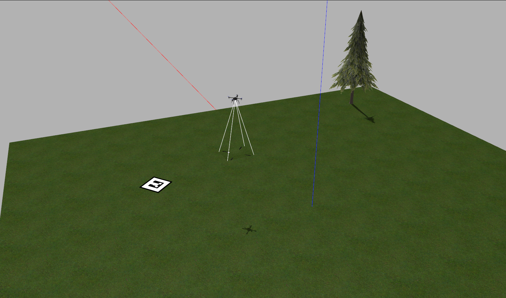
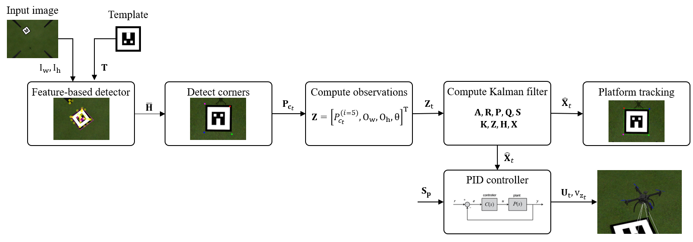
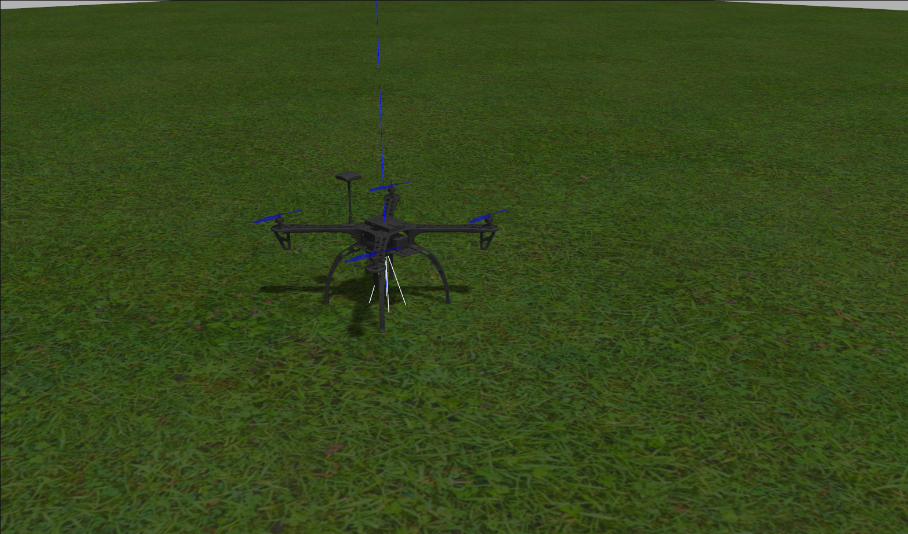

# Autonomous landing of a UAV

ROS packages developed for the autonomous landing of a UAV on a stationary platform.

<div  align="center">

</div>

## Description

The autonomous landing system has been tested in Simulation with Gazebo and with a modified DJI F450 with an onboard computer. The workflow of the system is a simulated environment is as follows. The system is launched in Gazebo and communicated with the Firmware of PX4. Then, the vehicle takeoff from the ground and moves to a position where the landing platform is visible. The detection module starts working and with a feature-based detector and a Kalman Filter, the landing pad is tracking thoroughly. Once the first estimation of the landing platform is made, the landing controller begins to work and moves the vehicle towards the center of the platform while it is descending. Finally, the vehicle lands and ends its mission.

<div  align="center">

</div>

This system can be used in more complex tasks where the landing phase wants to be automated. Precision agriculture, Patrolling and building inspection are just few examples where a system like this might be used to land the vehicle.

The following diagram illustrates  the  general  workflow  of  the system. First the homography matrix is computed between the current image frame and the predefined template, using  a  feature-based  detector.  Then,  the  homography  matrix is used to compute the corners and the centroid of the object.  These  points  are  then  passed to  a  Kalman  filter  estimation  module.  Finally,  the  Kalman filter  estimations  are  used  to  track  the  template  in  the  image frame, and passed as input for a set of three PID-based controllers that perform the safe landing of the vehicle

<div  align="center">

</div>

There are three main packages that compose this project, these are:

 1. mavros_off_board
 2. object_detector
 3. drone_controller

In the package *mavros_off_board* are the launch files, world file, description files (urdf, xacro, sdf) and basic scripts to control the aircraft. The package *object_detector* is the detection and tracking (Kalman Filter) pipeline of the system, this module allows the tracking of a landing template. Finally, *drone_controller* has the proportional and PID controllers developed to land the vehicle based on the estimations made with the *object_detector* package.

<div  align="center">

</div>

## Setting up the project

1. [Installation and environment configuration.](/Installation.md)

2. [Testing the SITL.](/Testing.md)

3. [Usage and deployment](/Usage.md)

The repository containing the evaluation of this work can be found [here](https://github.com/apinto25/autonomous_landing_data_analysis).


**Note:** This work was done as BEng degree project entitled "Autonomous landing system for a UAV on a ground vehicle" in "Universidad Autonóma de Occidente", Colombia. 

## Citation

If you use this code, please cite our [paper](https://arxiv.org/abs/2108.06616) as:

```
@article{9656574,
	title        = {Monocular Visual Autonomous Landing System for Quadcopter Drones Using Software in the Loop},
	author       = {Saavedra-Ruiz, Miguel and Pinto-Vargas, Ana Maria and Romero-Cano, Victor},
	year         = 2022,
	journal      = {IEEE Aerospace and Electronic Systems Magazine},
	volume       = 37,
	number       = 5,
	pages        = {2--16},
	doi          = {10.1109/MAES.2021.3115208}
}
```

## Bibliography

This work used the find_object_2d package developed by introlab, the citation can be seen below

```
@misc{labbe11findobject,
   Author = {{Labb\'{e}, M.}},
   Howpublished = {\url{http://introlab.github.io/find-object}},
   Note = {accessed 2019-04-02},
   Title = {{Find-Object}},
   Year = 2011
}
```
