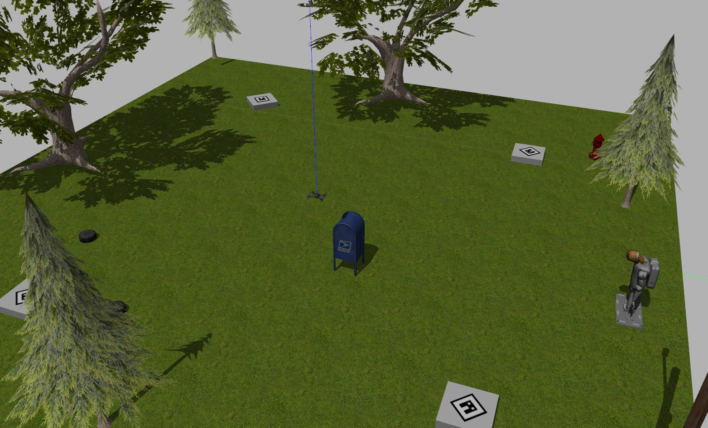

# Autonomous landing of a UAV 

ROS packages developed for the autonomous landing of a UAV on a stationary platform.

## Installation

To use this packages, [install OpenCV](https://www.pyimagesearch.com/2016/10/24/ubuntu-16-04-how-to-install-opencv/), [ROS kinetic](http://wiki.ros.org/kinetic/Installation), [Gazebo 7](http://gazebosim.org/tutorials?tut=install_ubuntu&ver=7.0&cat=install) and the [SITL ](https://dev.px4.io/v1.9.0/en/simulation/) provided by PX4 in Ubuntu 16.04.

To install [mavros](http://wiki.ros.org/mavros) and [find_object_2d](http://wiki.ros.org/find_object_2d) ROS packages

    $ sudo apt-get install ros-kinetic-mavros ros-kinetic-mavros-extras
    $ sudo apt-get install ros-kinetic-find-object-2d

## Usage

To launch the system in a simulated environment run:

    roslaunch mavros_off_board mavros_rviz

This will deploy the Gazebo world created with the UAV, allowing further iteration of the vehicle.

The system works with three different packages

 - mavros_off_board 
 - object_detector
 - drone_controller 

**mavros_off_board** has the configuration files of the vehicle with scripts to teleoperate and takeoff the vehicle. To Takeoff the vehicle and start its teleoperation 

    $ rosrun mavros_off_board offb_node
    $ rosrun mavros_off_board teleop_node_pos

**object_detector** detection pipeline with feature-based image detector and linear Kalman Filter.

To use the detection pipeline use 

    $ roslaunch object_detector detector.launch

**drone_controller** PD and PID controllers for the aunomous landing of the UAV. The process variable of the controller is the output of the detection pipeline. Do not use this package without the detector. To run the 

    $ rosrun drone_controller pid_controller_final 

The variables controlled are velocity in X and Y, the yaw rate and the position in Z. 

This work used the find_object_2d package developed by introlab, the citation can be seen below

> @misc{labbe11findobject,
   Author = {{Labb\'{e}, M.}},
   Howpublished = {\url{http://introlab.github.io/find-object}},
   Note = {accessed 2019-04-02},
   Title = {{Find-Object}},
   Year = 2011
}

The system was tested on a simulated environment using the SITL provided by PX4 and with a custom DJI F450 with an onboard camera and computer. 

This work was done as BEng degree project entitled "Autonomous landing system for a UAV on a ground vehicle" in the Autonoma de Occidente University, Colombia. 
