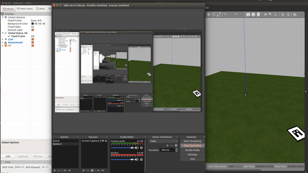
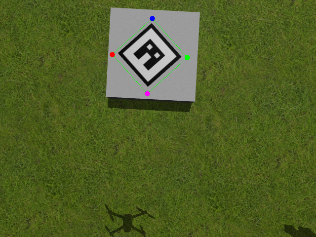

## Usage and deployment

The system has four launch files embedded in *mavros_off_board* and these are used to launch the vehicle, the functionality of each launcher is:

 - **posix_sitl.launch** It launches PX4 SITL in Gazebo
 - **mavros_posix_sitl.launch** This launch file launches Mavros, PX4 SITL and Gazebo. This launch file allows the control of the vehicle with ROS. The model launched is in sdf format.
 - **mavros_rviz.launch** This launch file is only for visualization purpose and shows the vehicle in Gazebo and Rviz. The model launched is in urdf format.
 - **urdf_launcher.launch** This launch file launches Mavros, PX4 SITL, Rviz and Gazebo. This launch file allows the control of the vehicle with ROS. The model launched is in xacro format.

The frames and TF of the vehicle in Rviz are shown in the next image.

<div  align="center">

</div>

Use the launch files based on your own needs. If you need only simulate the vehicle use **mavros_posix_sitl.launch**, but if visualization in Rviz is also needed use **urdf_launcher.launch**. 

With the package **mavros_off_board**  launch the system in a simulated environment 

```bash
cd PX4-Autopilot  
DONT_RUN=1 make px4_sitl_default gazebo
source ~/catkin_ws/devel/setup.bash
source Tools/setup_gazebo.bash $(pwd) $(pwd)/build/px4_sitl_default
export ROS_PACKAGE_PATH=$ROS_PACKAGE_PATH:$(pwd)
export ROS_PACKAGE_PATH=$ROS_PACKAGE_PATH:$(pwd)/Tools/sitl_gazebo
roslaunch mavros_off_board mavros_posix_sitl.launch
```

> **Note:** In case Gazebo is preventing to launch the vehicle, kill the gazebo server using `killall gzserver`

This will deploy the Gazebo world created with the UAV, allowing further iteration of the vehicle.

Once the simulation is running,  Takeoff the vehicle and start its teleoperation with

```bash
rosrun mavros_off_board offb_node
rosrun mavros_off_board teleop_node_pos
```

Move the vehicle with the keyboard along the simulation space and locate it above the landing pad.

To use the detection pipeline in **object_detector** use 

```bash
roslaunch object_detector simu.launch
```
This will start the detection module of the system and track the landing platform as shown by the image below.
 
 <div  align="center">

</div>

To land the vehicle use the **drone_controller** package. The process variable of the controller is the output of the detection pipeline. Do not use this package without the detector.  

```bash
rosrun drone_controller pid_controller_final 
```
The variables controlled are velocity in X and Y, the yaw rate and the position in Z of the quad-rotor.